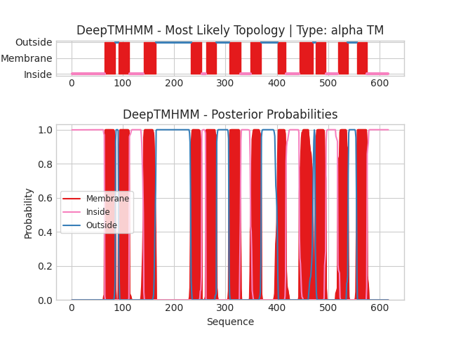

## DeepTMHMM - Predictions
Predicted topologies can be downloaded in [.gff3 format](TMRs.gff3) and [.3line format](predicted_topologies.3line)

You can download the probabilities used to generate this plot [here](Unnamed_probs.csv)
### Predicted Topologies
```
>Unnamed | TM
MLLARMNPQVQPENNGADTGPEQPLRARKTAELLVVKERNGVQCLLAPRDGDAQPRETWGKKIDFLLSVVGFAVDLANVWRFPYLCYKNGGGAFLIPYTLFLIIAGMPLFYMELALGQYNREGAATVWKICPFFKGVGYAVILIALYVGFYYNVIIAWSLYYLFSSFTLNLPWTDCGHTWNSPNCTDPKLLNGSVLGNHTKYSKYKFTPAAEFYERGVLHLHESSGIHDIGLPQWQLLLCLMVVVIVLYFSLWKGVKTSGKVVWITATLPYFVLFVLLVHGVTLPGASNGINAYLHIDFYRLKEATVWIDAATQIFFSLGAGFGVLIAFASYNKFDNNCYRDALLTSSINCITSFVSGFAIFSILGYMAHEHKVNIEDVATEGAGLVFILYPEAISTLSGSTFWAVVFFVMLLALGLDSSMGGMEAVITGLADDFQVLKRHRKLFTFGVTFSTFLLALFCITKGGIYVLTLLDTFAAGTSILFAVLMEAIGVSWFYGVDRFSNDIQQMMGFRPGLYWRLCWKFVSPAFLLFVVVVSIINFKPLTYDDYIFPPWANWVGWGIALSSMVLVPIYVIYKFLSTQGSLWERLAYGITPENEHHLVAQRDIRQFQLQHWLAI
IIIIIIIIIIIIIIIIIIIIIIIIIIIIIIIIIIIIIIIIIIIIIIIIIIIIIIIIIIIIIIIIMMMMMMMMMMMMMMMMMMMMMOOOOOOMMMMMMMMMMMMMMMMMMMMMIIIIIIIIIIIIIIIIIIIIIIIIIIIIMMMMMMMMMMMMMMMMMMMMMMMMOOOOOOOOOOOOOOOOOOOOOOOOOOOOOOOOOOOOOOOOOOOOOOOOOOOOOOOOOOOOOOOOOOOOMMMMMMMMMMMMMMMMMMMMMIIIIIIIIMMMMMMMMMMMMMMMMMMMMMOOOOOOOOOOOOOOOOOOOOOOOOMMMMMMMMMMMMMMMMMMMMMMMIIIIIIIIIIIIIIIIIIIMMMMMMMMMMMMMMMMMMMMMOOOOOOOOOOOOOOOOOOOOOOOOOOOOOOOOMMMMMMMMMMMMMMMMIIIIIIIIIIIIIIIIIIIIIIIIIIMMMMMMMMMMMMMMMMMMMMMMMMMMMOOOOMMMMMMMMMMMMMMMMMMMMMIIIIIIIIIIIIIIIIIIIIIIIMMMMMMMMMMMMMMMMMMMMOOOOOOOOOOOOOOOOOMMMMMMMMMMMMMMMMMMMMIIIIIIIIIIIIIIIIIIIIIIIIIIIIIIIIIIIIIIIIII

```


```
##gff-version 3
# Unnamed Length: 617
# Unnamed Number of predicted TMRs: 12
Unnamed	inside	1	64				
Unnamed	TMhelix	65	85				
Unnamed	outside	86	91				
Unnamed	TMhelix	92	112				
Unnamed	inside	113	140				
Unnamed	TMhelix	141	164				
Unnamed	outside	165	232				
Unnamed	TMhelix	233	253				
Unnamed	inside	254	261				
Unnamed	TMhelix	262	282				
Unnamed	outside	283	306				
Unnamed	TMhelix	307	329				
Unnamed	inside	330	348				
Unnamed	TMhelix	349	369				
Unnamed	outside	370	401				
Unnamed	TMhelix	402	417				
Unnamed	inside	418	443				
Unnamed	TMhelix	444	470				
Unnamed	outside	471	474				
Unnamed	TMhelix	475	495				
Unnamed	inside	496	518				
Unnamed	TMhelix	519	538				
Unnamed	outside	539	555				
Unnamed	TMhelix	556	575				
Unnamed	inside	576	617				

```
