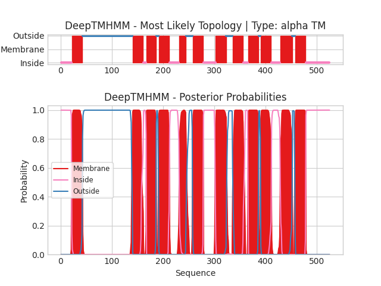

## DeepTMHMM - Predictions
Predicted topologies can be downloaded in [.gff3 format](TMRs.gff3) and [.3line format](predicted_topologies.3line)

You can download the probabilities used to generate this plot [here](Unnamed_probs.csv)
### Predicted Topologies
```
>Unnamed | TM
MLRTILDAPQRLLKEGRASRQLVLVVVFVALLLDNMLFTVVVPIVPTFLYDMEFKEVNSSLHLGHAGSSPHALASPAFSTIFSFFNNNTVAVEESVPSGIAWMNDTASTIPPPATEAISAHKNNCLQGTGFLEEEITRVGVLFASKAVMQLLVNPFVGPLTNRIGYHIPMFAGFVIMFLSTVMFAFSGTYTLLFVARTLQGIGSSFSSVAGLGMLASVYTDDHERGRAMGTALGGLALGLLVGAPFGSVMYEFVGKSAPFLILAFLALLDGALQLCILQPSKVSPESAKGTPLFMLLKDPYILVAAGSICFANMGVAILEPTLPIWMMQTMCSPKWQLGLAFLPASVSYLIGTNLFGVLANKMGRWLCSLIGMLVVGTSLLCVPLAHNIFGLIGPNAGLGLAIGMVDSSMMPIMGHLVDLRHTSVYGSVYAIADVAFCMGFAIGPSTGGAIVKAIGFPWLMVITGVINIVYAPLCYYLRSPPAKEEKLAILSQDCPMETRMYATQKPTKEFPLGEDSDEEPDHEE
IIIIIIIIIIIIIIIIIIIIIMMMMMMMMMMMMMMMMMMMMMOOOOOOOOOOOOOOOOOOOOOOOOOOOOOOOOOOOOOOOOOOOOOOOOOOOOOOOOOOOOOOOOOOOOOOOOOOOOOOOOOOOOOOOOOOOOOOOOOOMMMMMMMMMMMMMMMMMMMMMIIIIIIMMMMMMMMMMMMMMMMMMMOOOOOMMMMMMMMMMMMMMMMMMMMMIIIIIIIIIIIIIIIIIIIMMMMMMMMMMMMMOOOOOOOOOOOOOMMMMMMMMMMMMMMMMMMMMMIIIIIIIIIIIIIIIIIIIIIIIIMMMMMMMMMMMMMMMMMMMMMOOOOOOOOOOOOMMMMMMMMMMMMMMMMMMMMMIIIIIIIIIMMMMMMMMMMMMMMMMMMMMMOOOOMMMMMMMMMMMMMMMMMMMMMIIIIIIIIIIIIIIIIIMMMMMMMMMMMMMMMMMMMMMMMMOOOOOMMMMMMMMMMMMMMMMMMMMMIIIIIIIIIIIIIIIIIIIIIIIIIIIIIIIIIIIIIIIIIIIIIII

```


```
##gff-version 3
# Unnamed Length: 525
# Unnamed Number of predicted TMRs: 12
Unnamed	inside	1	21				
Unnamed	TMhelix	22	42				
Unnamed	outside	43	140				
Unnamed	TMhelix	141	161				
Unnamed	inside	162	167				
Unnamed	TMhelix	168	186				
Unnamed	outside	187	191				
Unnamed	TMhelix	192	212				
Unnamed	inside	213	231				
Unnamed	TMhelix	232	244				
Unnamed	outside	245	257				
Unnamed	TMhelix	258	278				
Unnamed	inside	279	302				
Unnamed	TMhelix	303	323				
Unnamed	outside	324	335				
Unnamed	TMhelix	336	356				
Unnamed	inside	357	365				
Unnamed	TMhelix	366	386				
Unnamed	outside	387	390				
Unnamed	TMhelix	391	411				
Unnamed	inside	412	428				
Unnamed	TMhelix	429	452				
Unnamed	outside	453	457				
Unnamed	TMhelix	458	478				
Unnamed	inside	479	525				

```
